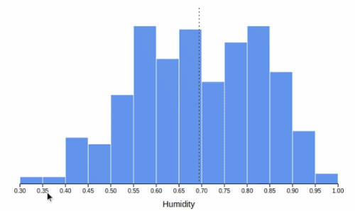

# d3-user-interactions

This project contains a D3 bar chart that allows user interactions.

You can see the bar chart responding to user interaction in the following gif.

## Running the project

- Clone the project
- Install an HTTP server and serve the project root folder

e.g

- `npm install -g http-server`
- `http-server ./`

**Then open your browser to interact with the chart.**

e.g

- Open [http://localhost:8080](http://localhost:8080)